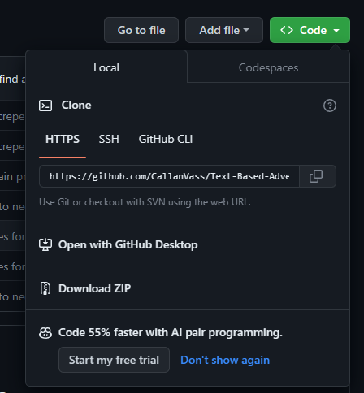

# Text-Based-Adventure-Game

# **Spoilers Ahead**

## R3 Bibliography/References:

 - Dewan, A 2022, Coding standards (style guide) for Python programs, www.tutorialspoint.com, viewed 19 October 2023, <https://www.tutorialspoint.com/coding-standards-style-guide-for-python-programs>.

 - Feldhausen, R 2022, Nested While Loops :: Intro CS Textbook, textbooks.cs.ksu.edu, viewed 19 October 2023, <https://textbooks.cs.ksu.edu/cs-zero/x-cis115-labs/12-nested-loops/01-nested-while-loops/#:~:text=To%20create%20a%20nested%20loop>.

 - How do I write a shell script to install a list of applications? 2021, Ask Ubuntu, viewed 26 October 2023, <https://askubuntu.com/questions/519/how-do-i-write-a-shell-script-to-install-a-list-of-applications>.

 - InVision | Digital product design, workflow & collaboration 2018, InVision | Digital product design, workflow & collaboration, InVision, viewed 18 October 2023, <https://www.invisionapp.com/>.

 - Lisowski, T 2021, How to Clone Using HTTPS in Git?, Blog | GitProtect.io, viewed 27 October 2023, <https://gitprotect.io/blog/how-to-clone-using-https-in-git/>.

 - Panjak 2022, Python wait time, wait for user input | DigitalOcean, www.digitalocean.com, viewed 21 October 2023, <https://www.digitalocean.com/community/tutorials/python-wait-time-wait-for-input>.

 - patorjk 2019, Text to ASCII Art Generator (TAAG), Patorjk.com, viewed 25 October 2023, <http://patorjk.com/software/taag/#p=display&f=Graffiti&t=Type%20Something%20>.

 - Press enter to dodge... (Quick time event) [Python 3] 2020, Stack Overflow, viewed 21 October 2023, <https://stackoverflow.com/questions/64028801/press-enter-to-dodge-quick-time-event-python-3>.

 - Python any() n.d., www.programiz.com, viewed 21 October 2023, <https://www.programiz.com/python-programming/methods/built-in/any>.

 - Python Random Module 2023, www.w3schools.com, viewed 20 October 2023, <https://www.w3schools.com/python/module_random.asp>.

 - Python time Module (with Examples) 2018, Programiz.com, viewed 21 October 2023, <https://www.programiz.com/python-programming/time>

 - Ramakrishna, S 2021, How to Read Text File in Python? | HackerNoon, hackernoon.com, viewed 27 October 2023, <https://hackernoon.com/how-to-read-text-file-in-python>.

 - Rocholl, JC 2023, pycodestyle: Python style guide checker, PyPI, viewed 25 October 2023, <https://pypi.org/project/pycodestyle/>.

 - Scott, B 2023, colour-text: colour_text that makes printing coloured text easier to do on Unix, macOS and Windows, PyPI, viewed 25 October 2023, <https://pypi.org/project/colour-text/>.

 - Singh, K 2023, What Is a Flag in While Loops? - AskPython, askpython.com, viewed 21 October 2023, <https://www.askpython.com/python/examples/flag-in-while-loops>.

 - Taylor, D 2019, Writing Secure Shell Scripts | Linux Journal, www.linuxjournal.com, viewed 27 October 2023, <https://www.linuxjournal.com/content/writing-secure-shell-scripts>.

 - van Rossum, G, Warsaw, B & Coghlan, N 2001, PEP 8 – Style Guide for Python Code | peps.python.org, peps.python.org, viewed 24 October 2023, <https://peps.python.org/pep-0008/>.

 - W3Schools 2019, Python Classes, W3schools.com, viewed 18 October 2023, <https://www.w3schools.com/python/python_classes.asp>.

 - w3schools 2023, Python While Loops, www.w3schools.com, viewed 19 October 2023, <https://www.w3schools.com/python/python_while_loops.asp>.

 - What is a Shell Script and How Does it Work? 2019, Tech Target, viewed 27 October 2023, <https://www.techtarget.com/searchdatacenter/definition/shell-script>.

## R4 Github Link:

[Repository link](https://github.com/CallanVass/Text-Based-Adventure-Game)

## R5 Style Guide:

Styling convention follows what is essentially PEP8, but with the notable exception of line length among my lines of code. I would have fixed most of text into a seperate file, however I only learnt this much later in the project, without the time to fix it. I've set a ruler in my settings.json file to ensure it doesn't happen again.

[Here is the guide](https://peps.python.org/pep-0008/)

## R6 List Of Features:

### Feature 1 -- Changeable Notebook

- On ever decision tree will be a changeable notebook as the first option. Upon selecting the notebook, it will open and allow you to either write in it or simply view it. The user can use this feature however they like, although it would be best for them to use it to record the quotes they come accross.

### Feature 2 -- Blood Glut Meter

- A meter that is set to 0 upon initialization of the program, the blood glut meter will update upon consuming blood, allowing the user access to better percentage chances of completing certain actions, but at the same time hindering others. One example is that the Ominous Spirit will not allow you to attempt the riddle if you're above 60 blood glut. Another is that if you exit the door with 100 blood glut (meaning you've turned into a vampire), you will burn in the sun, which is still a valid ending, just not a happy one.

### Feature 3 -- Multiple Rooms/Ways To Escape

- The game will have 3 endings. The first is solving the riddle and escaping past the Ominous Spirit, the second is gaining the master key from the armoury and escaping with the slaves, the third is defeating Dracula and escaping (this kills the player). There is another option, which is to cram the slaves back into their cells and remain as master of the castle.

## R7 Checklist Of Features:

### Feature 1 -- Changeable Notebook

- .txt file is called via the Options class using the open() fuction

- .txt file is opened with the "r" function, allowing the user to see past writings

- .txt file is appended by user using the open() function with an "a" for append

- Appended text is saved to the .txt file due to using the with open() as f: function

- TODO: Add notebook to list of actions displayed to user (in 1st place) (Will only be possible once options class is sorted)

### Feature 2 -- Blood Glut Meter

- Set to 0 by attaching it to the character class with a hardcoded value.

- Nest blood glut with option-handling while loops that run the main() program. Only if certain actions are completed is it to be increased.

- Tie blood glut meter to escape ending where player burns. Using conditional statemets such as if blood_glut => 100 for certain endings.

- Display blood glut meter at the top of the terminal options with every choice. This will simply be a matter of setting a "getter" method within the character class. Such as Character.get_glut_meter().

- Ensure there are options that player cannot complete if blood_glut_meter isn't high enough (e.g freeing the slaves). if blood_glut_meter < 50, can't complete action.

### Feature 3 -- Multiple Endings/Ways To Escape

- Create Room class to contain individual rooms to certain blocks of code. class = Room

- Write base script for each room in the main section, then move it to suit individual needs. 

- Contain options to lists of printed statements so that options can be referenced by their index, such as Room[0][0].

- Use break statements to finish while loops to create alternate endings.

- Attach the inventory class to the rooms for items that can be picked up. I'll do this by using comprehension. E.g self.inv = Inventory[]

#### Testing These Features:

 - Test 1: Blood Glut Meter

 To test the Blood Glut Meter is working as planned, I have gone to each instance where the Meter can be increased and ensured the amount increase displayed on screen corresponds with the amount added to the Meter.
 
 I have also tested the Meter doesn't increase by more than 100 by A: creating an if statement that dictates that if the Meter goes over 100, it will set it to 100 automatically. This can be found on line 32 of the classes.py file.
 
 On top of both of these, I have have tested out options that are denied if the Meter is above a certain threshold. One example of this is killing the servant in the Treasury and then asking the Ominous Spirit in the Tunnel area to let you pass. While the Meter is equal to or above 50, the Spirit will not allow you to attempt to answer the riddle. I have confirmed this myself multiple times.

 - Test 2: Multiple Endings/Ways to Escape

To test the games endings function as they should, I have gone through each and every single one to make sure the ending displayed corresponds correctly with the actions the user has taken throughout the game. 

This includes endings such as the 'blugeon self' ending, where the character simply ends the game early, the ending where Dracula is killed by the player, the ending where the player spares Dracula, the ending where the player is let past the Ominous Spirit due to answering the riddle, another where the Ominous Spirit lets the player by due to being annoyed with their staring. 

On top of these, I have ensured that the endings change when certain boolean values are True or False - such as changes in the endings due to having freed the prisoners or not.

## R8 Installation instructions:

### System requirements:

Most operating systems will run Python 3. In case you're curious, here is a list of requirements:
 - Windows 7 or 11
 - Mac OS X 10.11 or higher, 64-bit
 - Linux: RHEL 6/7, 64-bit (almost all libraries also work in Ubuntu)
 - x86 64-bit CPU (Intel / AMD architecture). ARM CPUs are not supported.
 - 4 GB RAM
 - 5 GB free disk space

You may want to have more than this if you want a smoother experience.

### Installation:

#### Step 1:

Which terminal to use?

WINDOWS:

First you'll want to install Ubuntu, which is a subsytem of Linux for Windows. Essentially, this lets you run Linux (an operating system) on your own operating system by creating an miniature environment where that can safely happen.

(If you're on windows, here is the installation link for the Microsoft Store.)[https://apps.microsoft.com/detail/9PDXGNCFSCZV?rtc=1&hl=en-au&gl=AU]

Once you've installed Ubuntu, you will be prompted to create a username and password. It's advised you create a username and password you'll remember, as you may need it again in the future if you wish to use Linux again.

MAC:

If you're a Mac user, you can simply navigate to your own terminal.

#### Step 2:

Navitage to the GitHub repository and copy the text from the HTTPS submenu under the green code button. (Here is a link for those who've forgotten.)[https://github.com/CallanVass/Text-Based-Adventure-Game]

Navigate to where you would like the file to be cloned into (placed) using the "cd" function. E.g "cd thisfolder". You can make a new folder to put it in, or simply install it in the home directory, although it's highly recommended to create a new directory (folder).

For Ubuntu and Mac users alike, this is achieved via the "mkdir" command, followed by the name you wish to use for the folder. E.g "mkdir game" to create a new directory named "game".

Once you're in the directory you want to use, enter the command "git clone https://github.com/CallanVass/Text-Based-Adventure-Game.git". Simply put, all you need to type is "git clone" followed by the link you've just copied from the submenu in GitHub. Then simply hit enter.

#### Step 3:

Once you've done this, navigate into the folder itself. You'll see a few different files, however all you need to do is enter this command: "./install_and_run.sh". This command will check you have Python installed, and if you don't it will do the installation for you. It will do the same with the dependencies of the project, so there's no need to lift a finger. After that, it will run the game. Simple as that. 

If you ever wish to run the game again, simply enter that same command.

You'll likely see something similar to this, but instead of informing you that you've got it installed, it will likely do the installation for you. You may have to enter your password to install the dependencies.

